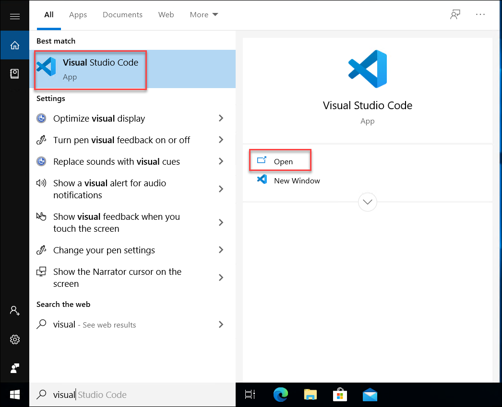
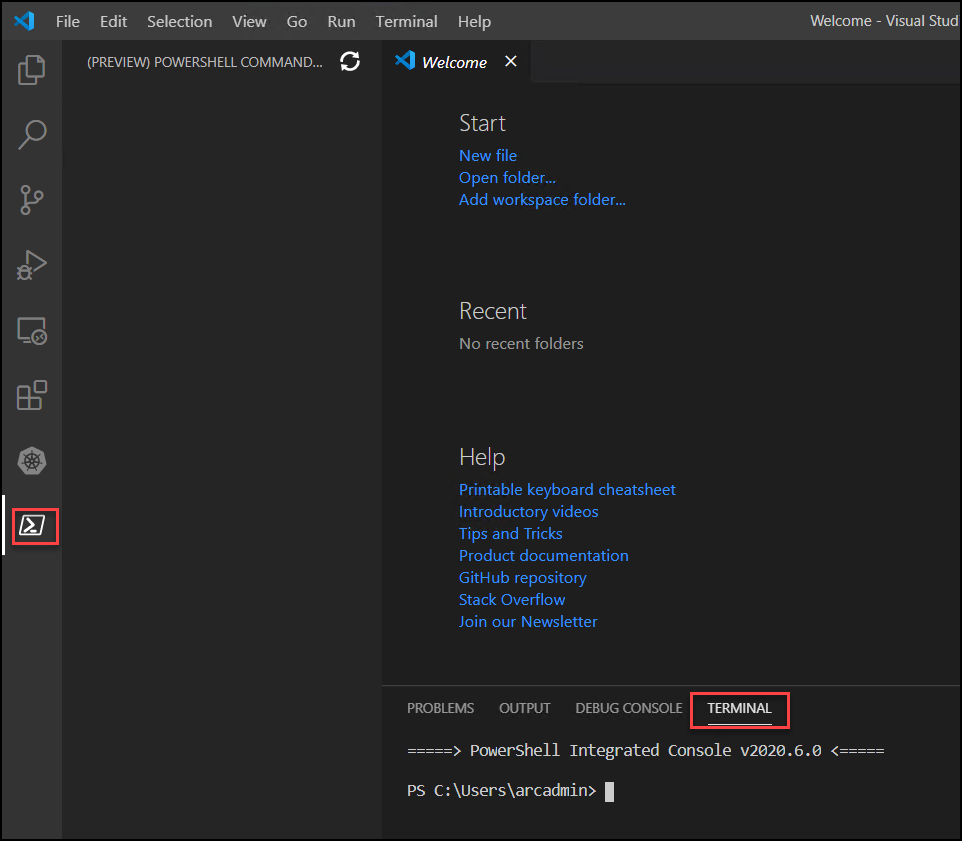
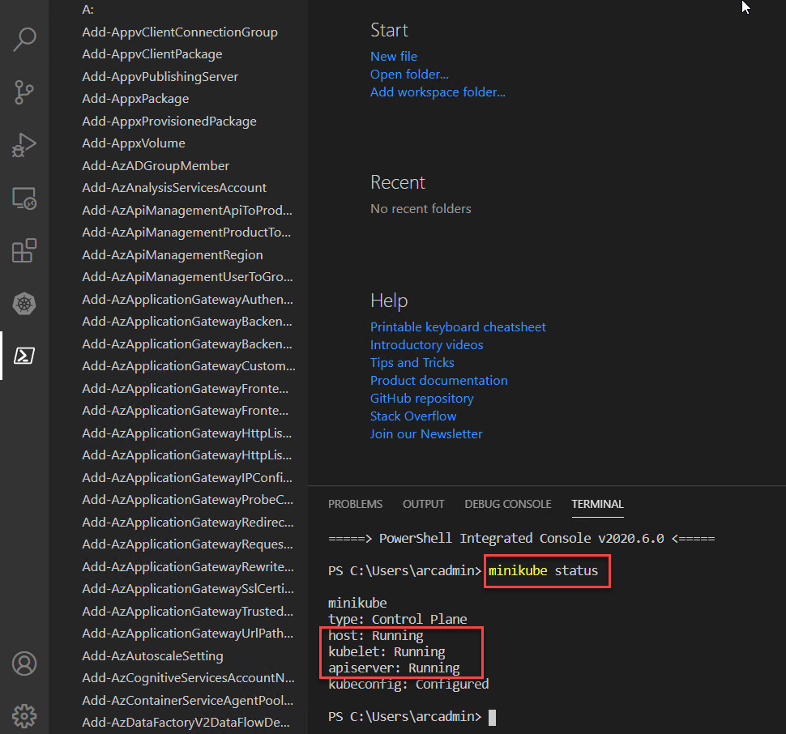

# Exercise 2: Getting started with On-Prem Kubernetes Cluster
In the provided lab environment, you would already have one Windows 10 machine running with Kubernetes Cluster already deployed and running. In this exercise, we’ll connect to the VM and check the existing Kubernetes Cluster

## Task 1: Verify existing Kubernetes Cluster
In this task, you will check the existing Kubernetes cluster and verify that the cluster is up and running. 

1. Open **Visual Studio Code**

    

2. Click on the **Kubernetes** icon and verify whether the cluster **minikube** is present,explore the different features available.
   
    
   
3. Open the **Powershell terminal** within the Visual studio code .
    
    

4. If the cluster is running, the output from minikube status should be similar to:
   
   ```
   minikube status
   ```
    
   
   >Note: If the cluster status is **Stopped**,Run the following commands
   
   ```
   minikube delete
   ```
   
   ```
   minikube start
   ```

   
   ## Task 2: Configuring WSL environment on Windows
   
   
   
   ## Task 3:Connect to Kubernetes cluster using WSL
In this exercise, you explored about how to check the already onboarded Hybrid compute servers. In next exercise, you will explore more on onboarding the Azure Arc/Hybrid compute on-prem servers to Azure Arc.
