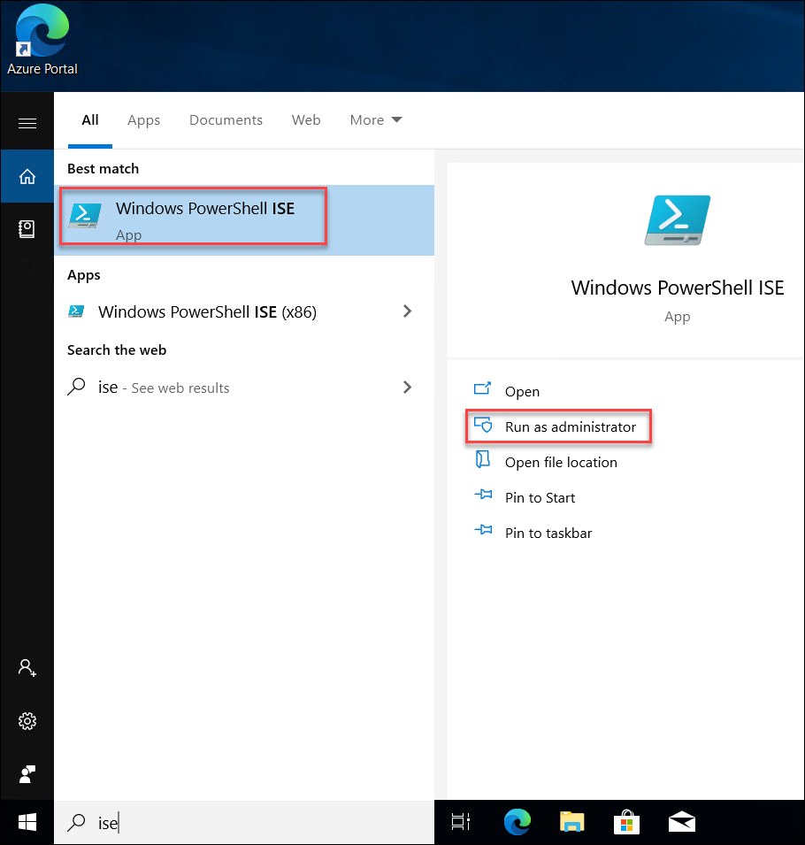
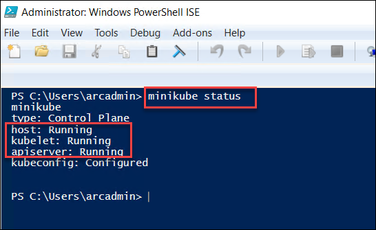
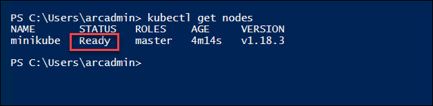

# Exercise 2: Getting started with On-Prem Kubernetes Cluster
In the provided lab environment, you would already have one Windows 10 machine running with Kubernetes Cluster already deployed and running. In this exercise, we’ll connect to the VM and check the existing Kubernetes Cluster

## Task 1: Verify existing Kubernetes Cluster
In this task, you will check the existing Kubernetes cluster and verify that the cluster is up and running. 
1. Open **Windows Powershell ISE** as a administrator

    

2. Run the following command to check the status of the cluster.

   ```
   minikube status
   ```
   If your cluster is running, the output from minikube status should be similar to:
   
   
   
   >Note: If the status shows as **Stopped**,Run the following commands
   
   ```
   minikube delete
   ```
   
   ```
   minikube start
   ```

3. To get status of all nodes, execute below command:
  
   ```
   kubectl get nodes
   ```
   The status should show as **Ready** as shown below:
  
   
   
In this exercise, you explored about how to check the already onboarded Hybrid compute servers. In next exercise, you will explore more on onboarding the Azure Arc/Hybrid compute on-prem servers to Azure Arc.
