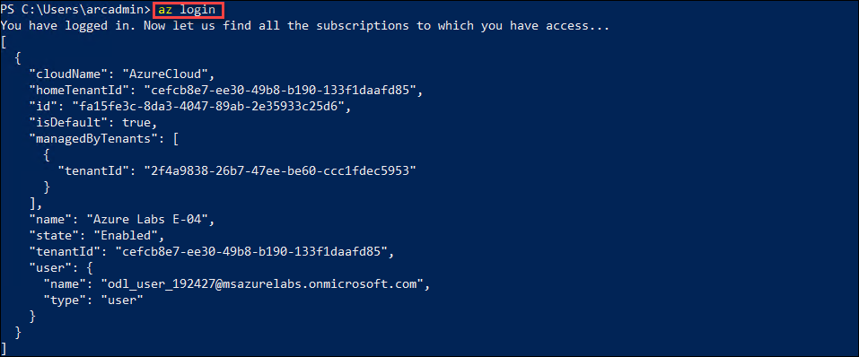
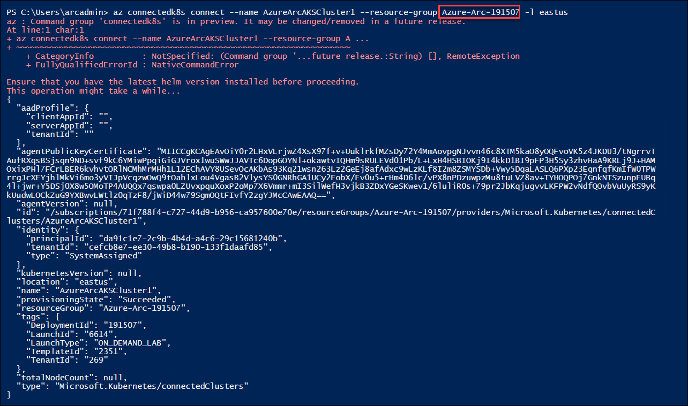
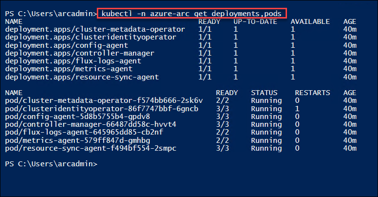

# Exercise 3: Onboard Kubernetes Cluster to Azure Arc
Azure Arc extends Azure Resource Manager capabilities to Linux and Windows servers, as well as Kubernetes clusters on any infrastructure across on-premises, multi-cloud, and edge. With Azure Arc, customers can also run Azure data services anywhere, realizing the benefits of cloud innovation, including always up-to-date data capabilities, deployment in seconds (rather than hours), and dynamic scalability on any infrastructure. Azure Arc for servers is currently in public preview.

## Task 1: Connect the cluster to Azure Arc
1. In the powershell window ,run the following command to login to azure
    
   ```
   az login
   ```
   This will launch a browser,Login with the credentials provided in the environment details page
   
    

2. Connect to the Kubernetes cluster by executing the following command:
   - Replace the XXXXXX with the deploymentID provided in the environment details page
   
   ```
   az connectedk8s connect --name AzureArcAKSCluster1 --resource-group Azure-Arc-XXXXXX -l eastus
   ```
   > Note:The command might take around 20 mins to complete the execution
   
   The output should be similar as shown:
   
    

## Task 2: Verify the cluster from Azure Portal
Azure Arc for servers (preview) allows you to manage your Windows and Linux machines hosted outside of Azure on your corporate network or other cloud provider, similarly to how you manage native Azure virtual machines. When a hybrid machine is connected to Azure, it becomes a connected machine and is treated as a resource in Azure. Each connected machine has a Resource ID, is managed as part of a resource group inside a subscription, and benefits from standard Azure constructs such as Azure Policy and applying tags.

1. Verify whether the cluster is connected by running the following command
   
   - Replace the XXXXXX with the deploymentID provided in the environment details page

   ```
   az connectedk8s list -g Azure-Arc-XXXXXX -o table  
   ```
   

2. Azure Arc enabled Kubernetes deploys a few operators into the azure-arc namespace. You can view these deployments and pods by running the command:
   
   ```
   kubectl -n azure-arc get deployments,pods
   ```
   The output should be similar as shown:
   
    
