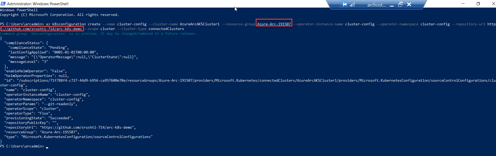
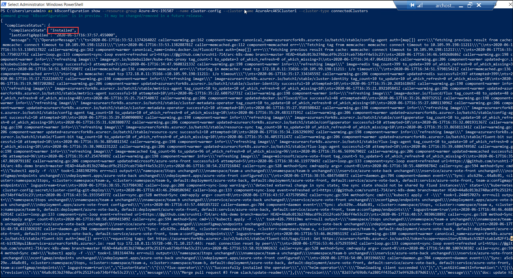

# Exercise 4: Deploy Sample Kubernetes App through Azure Arc

## Task 1: Create a Configuration

1. Fork the repository https://github.com/Azure/arc-k8s-demo to your personal github account as this is used in the later part of the lab.

## Task 2: Deploy App using az k8sconfiguration

1. Using the Azure CLI extension for k8sconfiguration, link connected cluster to personal git repository. Provide this configuration a name cluster-config, instruct the agent to deploy the operator in the cluster-config namespace, and give the operator cluster-admin permissions. 

2. Run the following command
  - Replace the XXXXXX with the deploymentID provided in the environment details page
  - Replace the **your personal github account name** with your personal github account that you are using to perform the lab.

  ```
  az k8sconfiguration create --name cluster-config --cluster-name AzureArcAKSCluster1 --resource-group Azure-Arc-XXXXXX --operator-instance-name cluster-config --operator-namespace cluster-config --repository-url https://github.com/<your personal github account name>/arc-k8s-demo --scope cluster --cluster-type connectedClusters
   ```
 The output should be as shown:

  

## Task 3: Validate the sourceControlConfiguration

1. Validate whether the sourceControlConfiguration was successfully created.

   ```
   az k8sconfiguration show --resource-group Azure-Arc-XXXXXX --name cluster-config --cluster-name AzureArcAKSCluster1 --cluster-type connectedClusters
   ```
   Note that the sourceControlConfiguration resource is updated with compliance status, messages, and debugging information in the output.

  The output should be as shown:

   
