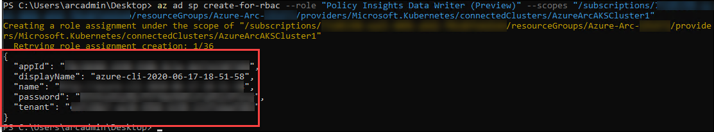
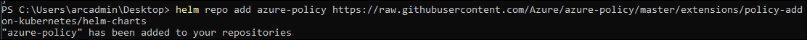
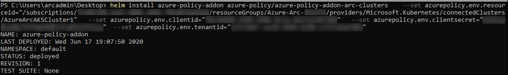
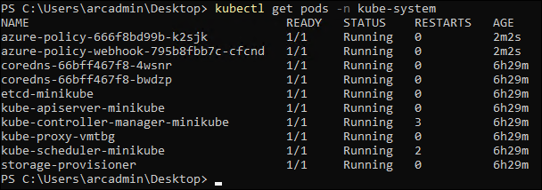
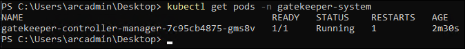

# Exercise 5: Azure Governance for Kubernetes on Azure Arc
In this exercise, you will perform Role assignment, Policy assignment, Tag the Azure Arc Enabled Kubernetes and check Activity logs of resource group and azure arc resource.

Using custom roles you can manage the access to the Azure Arc servers and assign the access of Azure Arc servers to any server auditor, Onboard Arc servers, Monitor Admin to the person in your company.

You can assign the in-Built policies to enforce configurations on Azure Arc enabled Kubernetes Clusters. You can filter the Clusters and apply the policies based on Tags.

## Task 1: Install Azure Policy Add-on for Azure Arc enabled Kubernetes

Azure Policy extends Gatekeeper v3, an admission controller webhook for Open Policy Agent (OPA), to apply at-scale enforcements and safeguards on your clusters in a centralized, consistent manner. Azure Policy makes it possible to manage and report on the compliance state of your Kubernetes clusters from one place. The add-on enacts the following functions:

     - Checks with Azure Policy service for policy assignments to the cluster.
     - Deploys policy definitions into the cluster as constraint template and constraint custom resources.
     - Reports auditing and compliance details back to Azure Policy service.

1. Assign 'Policy Insights Data Writer (Preview)' role assignment to the Azure Arc enabled Kubernetes cluster. Replace <subscriptionId> with your subscription ID, <rg> with the Azure Arc enabled Kubernetes cluster's resource group, and <clusterName> with the name of the Azure Arc enabled Kubernetes cluster. Keep track of the returned values for appId, password, and tenant for the installation steps. 

    ```
    az ad sp create-for-rbac --role "Policy Insights Data Writer (Preview)" --scopes "/subscriptions/<subscriptionId>/resourceGroups/<rg>/providers/Microsoft.Kubernetes/connectedClusters/<clusterName>"
    ```

2. The output of the above command will will look like below.
	
   

3. Run the following commands in Powershell to add the Azure Policy Add-on repo to Helm.
 
     ```
     helm repo add azure-policy https://raw.githubusercontent.com/Azure/azure-policy/master/extensions/policy-addon-kubernetes/helm-charts 
    ```

   

4. Run the following commands in Powershell to install the Azure Policy Add-on repo to Helm.

   
   
   ```
   # In below command, replace the following values with those gathered above.
   # <AzureArcClusterResourceId> with your Azure Arc enabled Kubernetes cluster resource Id. For example: /subscriptions/<subscriptionId>/resourceGroups/<rg>/providers/Microsoft.Kubernetes/connectedClusters/<clusterName>
   #    <ServicePrincipalAppId> with app Id of the service principal created during prerequisites.
   #    <ServicePrincipalPassword> with password of the service principal created during prerequisites.
   #    <ServicePrincipalTenantId> with tenant of the service principal created during prerequisites.
   helm install azure-policy-addon azure-policy/azure-policy-addon-arc-clusters --set azurepolicy.env.resourceid=<AzureArcClusterResourceId> --set azurepolicy.env.clientid=<ServicePrincipalAppId> --set azurepolicy.env.clientsecret=<ServicePrincipalPassword> --set azurepolicy.env.tenantid=<ServicePrincipalTenantId>
   ```

5. Now, to validate that the add-on installation was successful and that the azure-policy and gatekeeper pods are running, run the following commands.

 
    
     ```
    # azure-policy pod is installed in kube-system namespace
	kubectl get pods -n kube-system
     ```
   
   
    ```
    # gatekeeper pod is installed in gatekeeper-system namespace
	kubectl get pods -n gatekeeper-system
    ```
   


## Task 2: Apply Policy
Policies can be applied to ARC servers the same way they are applied to Microsoft Azure virtual machines. Policies can be applied to ensure the Azure resources are compliant with established practices such as ensuring that all resources are tagged with an owner. Initiatives can be applied to ensure the server operating systems are compliant such as ensuring the time zone is set correctly on a Microsoft Windows server or a software package is installed on a Linux server. The initiatives use a publish policy to deploy a configuration requirement and an audit policy to check if the requirement has been met.

1. From the **Machine -Azure Arc** menu for the Hybrid Server you are working with, click on **Policies**

   

2. Click **Assign policy**.

   

3. To the right of **Basics** click on the ellipses (…) to the right of **Initiative definition**.

   

4. In the **Search** window for available definitions, type “Time ” and select the one called **Show Audit results from Windows VMs that are not set to the specified time zone**.  Click the blue **Select** button below.

   

5. Click **Next** at the bottom of the window.

   

6. From the **Time zone** drop down menu select **“(UTC) Coordinated Universal Time”**. Click **Next**
7. Read the description and then select the checkbox for **Create a remediation task**. This ensures that the policy will apply to existing resources after the policy is assigned.  If that box is not selected, then the policy only applies to newly created resources.
8. Select the **Create a Managed Identity** check box and the click **Next** again

   

9. Then at the bottom of the **Assign Policy** window click on **Create**.

   

10. Click on the new policy just created **Audit Windows VMs that are not set to the specified time zone**
11. Click **Create a Remediation Task** at the top right

    

12. Confirm that the **Scope** is showing the correct Resource Group – should default to …/Azure-ARC-171289

    

      a. Click on the **ellipses** …to the right to select all options to include the server as shown to the right

13. Select the Checkbox beneath **Re-evaluate resource compliance before remediating**
14. In the **Locations** drop-down list, select the location where you installed your ARC Server
      * If you are not sure or can’t remember, look on the **Overview** window for your server
15. Click **Remediate** at the bottom of the **New Remediation Task** window

    

In the next window at the bottom you will see a blue circle beside **Evaluating**. When it is successful and completed, the circle will turn green and it will say **Complete**. NOTE: if you had many ARC servers, you could evaluate the all at once but changing the scope to select one of more locations or all within a resource group.

   

Optional initiatives to try… repeat the steps above to test some other policies such as:

**Operational compliance**
  * Micro-segmentation to ensure servers are connected to the right network (remote host connection status doesn't match the specified one)
  * Certificate about to expire
  * Application installed: ensure backup is installed
  * Machines are not restarted after 45 days, indicator that it has been forgotten, running but not used

**Security compliance**
  * Password policy
  * Application installed or not installed (like diagnostic tools used for investigation, but make sure it is removed after troubleshooting)
  * TLS 1.2 monitoring => part of PCI DSS (data security standard)

16. You can check your server is **compliant** or **not** against **“[Preview]: Configure time zone on Windows machines”** policy you assigned in previous step. Click on the **policies** from winvm options from left hand pane and then look for **Compliance** state. You can see **winvm** is compliant against this policy.

    

**Note**: If you find **winvm non-compliant** means time zone of winvm is different from the time zone you provided in policy. You can change the time zone of winvm using following script and after sometime you will see the winvm complaint state changed to **Compliant**

   ```
      $ap = "demo@pass123" 
      $cred = New-Object -ArgumentList "Administrator",(ConvertTo-SecureString -AsPlainText -Force -String $ap) -    TypeName System.Management.Automation.PSCredential 
      $ip = "192.168.0.5" 
      Invoke-Command -ComputerName $ip -Credential $cred -ScriptBlock {Set-TimeZone -Id '(UTC) Coordinated Universal Time'} 
   ```
    
## Task 3: Tag your ARC server
1. Open the Azure portal page. Click on this link to go to the Azure ARC machine(s) you have built
2. Click on your machine that you want to tag

   

3. After clicking on it, Click on **Tags** in the center blade

   

4. Create the following tags, for owner enter your Azure account unique id and then Save them
   
   

5. After saving them they should look like this.&nbsp;&nbsp;

   

## Task 4: Activity Logs
In last task, you added **tags** to one of the **Hybrid Computes machines**, check the **activity logs** for that.
1. In this step, click on the **Activity logs**, you will see **Write Azure Arc Machines** operation is performed. Expand the operation and click on the one of **expanded operation**.

   

2. Now, click on the **Change history (Preview)**, you can see multiple Tags inserted. In same way you can check more **Tags**.

   
