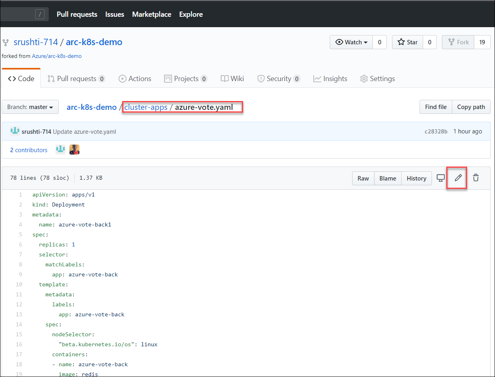
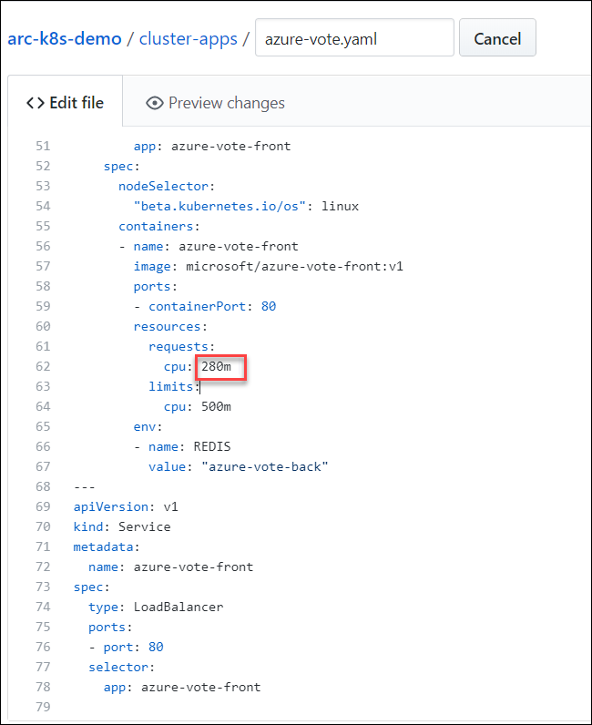
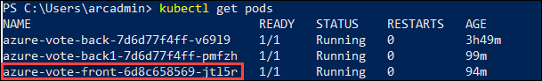
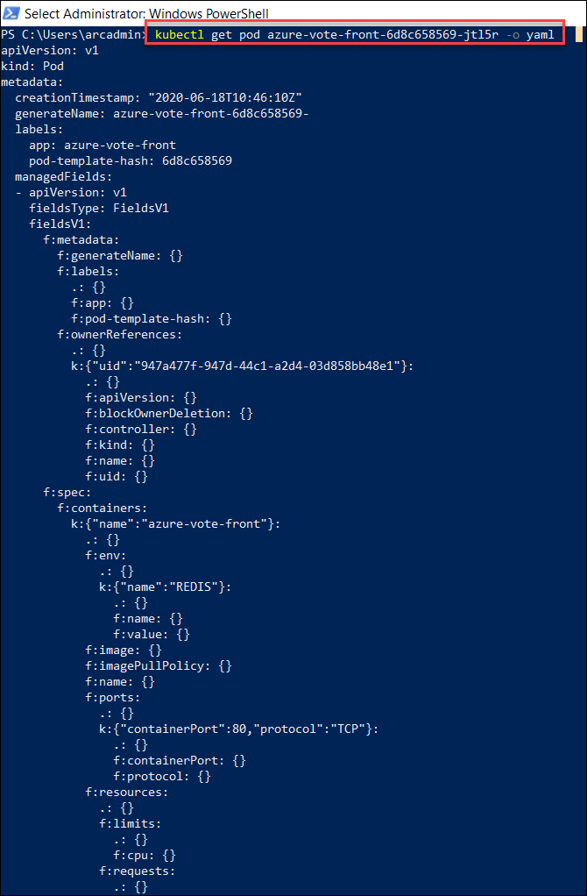
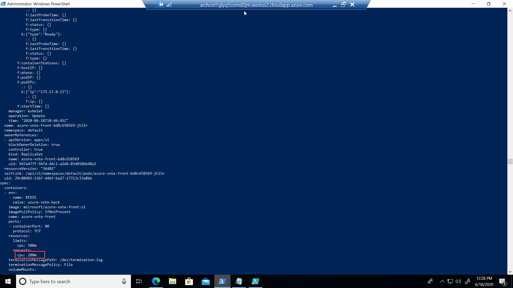

# Exercise 6: Update Configuration

## Task 1: Make changes to cluster declarations in the Git repo.

1. Browse to the forked repo of https://github.com/Azure/arc-k8s-demo

2. Navigate to **cluster-apps->azure-vote.yaml**

      

3. Change the cpu request from 250 to **280** in line 62 

      

## Task2: Verify changes are deployed to the cluster.

1.  Run the following command and copy the pod name starting with **azure-vote-front**

    ```
    kubectl get pods 
    ```
      

2.  Replace the pod name that you copied in the previous step and run the command
 
    ```
    kubectl get pod <podname> -o yaml
    ```
       
    
    Observe the CPU request value that you updated in the previous steps in the output as shown:
    
       

